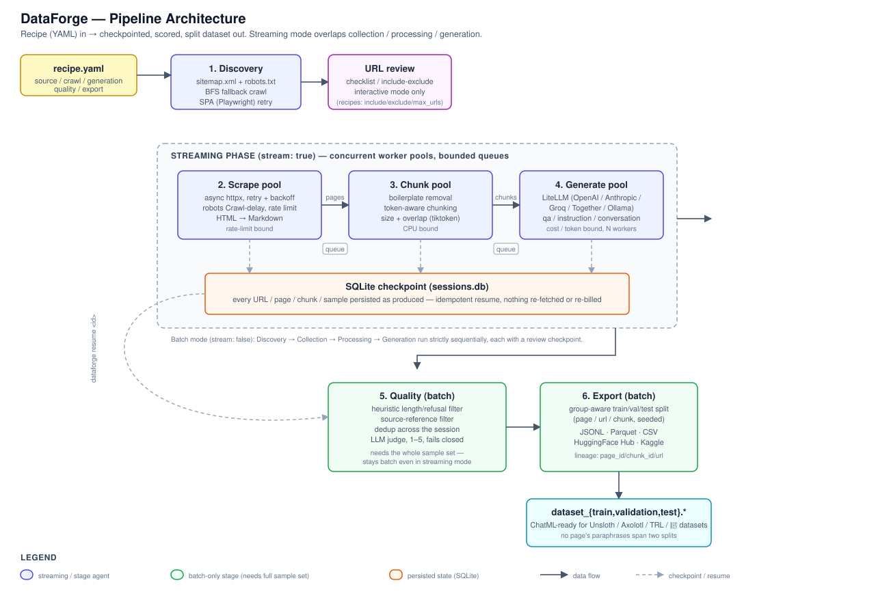

# Architecture



A run is six stages driven by one recipe (YAML) or an interactive wizard.
The first four are a producer/consumer chain that can run either strictly
sequential (**batch mode**) or as concurrent worker pools (**streaming
mode**, `stream: true`, the recipe default). Quality and Export always run
as batch stages because deduplication and splitting need to see the whole
sample set at once.

```
Discovery → Collection → Processing → Generation → Quality → Export
```

```
Discovery → ┌─────────── Streaming ───────────┐ → Quality → Export
            │ scrape ⇄ chunk ⇄ generate       │
            └─────────────────────────────────┘
```

Both modes are pausable and resumable, and sessions are interchangeable
between them: a run paused in batch mode can be resumed with streaming
enabled and vice versa.

## Stages

### 1. Discovery
Finds candidate URLs before a single page is fetched:
- Parses `sitemap.xml` (including sitemap indexes) and checks `robots.txt`
  for `Sitemap:` directives.
- Falls back to a BFS crawl (configurable depth/page limit) when no sitemap
  exists.
- Detects JavaScript-rendered pages (few links, rich body) and retries with
  Playwright if installed.
- Runs in parallel across multiple seed URLs.
- Interactive mode adds a checklist review step (substring / glob / regex
  filter, per-URL toggle, persisted across resume); recipes replace this
  with `source.include` / `source.exclude` / `source.max_urls`.

### 2. Collection (scrape pool)
- Async HTTPX client with retry + exponential backoff.
- **Transient statuses retry** — `429`, `500`, `502`, `503`, `504`, up to
  three times, because the server is saying "later," not "no."
- **`Retry-After` is honoured** (delta-seconds or HTTP-date), capped at
  120s so one URL cannot stall a run.
- **Permanent statuses do not retry** — a `404` or `403` is taken at its
  word.
- **`robots.txt` `Crawl-delay` is enforced** and only ever slows a crawl
  down; a permissive `Crawl-delay` never overrides a stricter configured
  `rate_limit`.
- Failures are logged, counted, and isolated — the rest of the crawl
  continues, and because a URL is only marked scraped after a successful
  fetch, `dataforge resume` retries exactly the ones that failed.
- Non-HTML resources (PDFs, images, archives) are filtered before a request
  is made.
- Pages are saved as Markdown in the session directory.

### 3. Processing (chunk pool)
- Boilerplate removal (nav, footer, cookie notices, etc.).
- Token-aware chunking with configurable size and overlap (`tiktoken`).

### 4. Generation (generate pool)
- Synthetic Q&A, instruction, and conversation samples via LiteLLM.
- Supports OpenAI, Anthropic, Groq, Together AI, and local Ollama.
- Custom system prompt support (`generation.format: custom`).

### 5. Quality (batch)
Layered filters, cheapest first:
1. **Heuristic pre-filter** — answer/question length and refusal detection
   against `quality.threshold`. Free, but on its own passes almost any real
   answer.
2. **Source-reference filter** — rejects samples that talk about "the
   document" or "the passage" instead of the subject. Free, always on.
3. **Deduplication** — exact full-content match across the whole session,
   plus a near-duplicate check (token-overlap/Jaccard similarity,
   `quality.near_dup_threshold`) scoped to samples from the same chunk,
   since `n_per_chunk` paraphrases are exactly what an exact-hash check
   cannot catch.
4. **LLM judge** (`quality.llm_judge`, on by default in recipes) — reads
   each sample next to the chunk it came from and rejects anything wrong,
   unsupported, or scoring below `min_judge_score` (1–5). Roughly doubles
   LLM cost.
5. **Fails closed** — a sample the judge cannot score is rejected, never
   approved.

The stage logs a rejection breakdown (`refers to the source`, `not grounded
in source`, `judge score 3 < 4`, …). The judge is dependable on clear
failures (wrong facts, unsupported claims, source references) and less
consistent on vague-but-true answers near the threshold; set
`min_judge_score: 5` to trade recall for precision.

### 6. Export (batch)
- JSONL / Parquet / CSV locally, or HuggingFace Hub / Kaggle.
- **Leak-free train/validation/test splits.** A synthetic dataset built from
  scraped pages is not independently distributed — several samples come
  from one chunk, and several chunks from one page, so every sample tracing
  back to a page is a paraphrase of the same source text. Splitting at the
  sample level lets near-duplicates land on both sides and inflates eval
  scores. `export.split.group_by: page` (default) assigns whole pages to
  one split and verifies that property before writing, rather than
  assuming it.
- Every export carries `page_id`, `chunk_id`, `chunk_index`, and
  `source_url` alongside the messages, whether or not you split — that
  lineage is what makes a correct split possible later.

## Streaming design

By default the four collection→generation stages run strictly one after
another, so the LLM idles through the entire crawl. `stream: true` runs
them as concurrent worker pools instead:

```
urls ─▶ [scrape pool] ─▶ pages ─▶ [chunk pool] ─▶ chunks ─▶ [LLM pool] ─▶ samples
```

- A page that finishes downloading is chunked immediately, and its chunks
  enter generation while the crawler is still working.
- **Bounded queues** apply backpressure so a fast crawler cannot exhaust
  memory ahead of a slower LLM (`DATAFORGE_STREAM_QUEUE_SIZE`).
- **Independent pool sizes** — scraping is rate-limit bound, generation is
  cost/token bound. Tune generation concurrency via
  `DATAFORGE_STREAM_GENERATE_WORKERS`.
- **Failure isolation** — a dead URL, an unparsable page, or one bad LLM
  response is logged and skipped; the pools keep running.
- **Graceful degradation** — if generation fails fatally (missing key,
  provider down), scraping and chunking still finish, so nothing is lost
  and a resume only has to generate.
- **Idempotent resume** — resuming replays only what is genuinely
  unfinished: URLs never fetched, pages never chunked, chunks never
  generated. No page is downloaded twice and no LLM call is paid for
  twice.

## Persistence

Every page, chunk, and sample is checkpointed to SQLite (`storage/`,
SQLModel) as it is produced, with autosave after every stage
(`DATAFORGE_AUTOSAVE`). `Ctrl-C` mid-run costs only the item in flight.
`dataforge resume <id>` continues an interrupted session in either mode,
`dataforge view <id> --stage generation` inspects what was produced,
`dataforge export <id>` re-exports without re-running collection or
generation, and `dataforge stats <id>` reports dataset-level statistics —
approval rate, rejection-reason breakdown, quality-score distribution,
question/answer length, and realized train/validation/test proportions from
the most recent export — read entirely from data the pipeline already
computed, including for a past session.

## Module layout

```
src/dataforge/
├── agents/          # pipeline stage agents + streaming pipeline
├── cli/             # typer app, prompts, UI, recipes, headless runner
├── collectors/      # HTTP client, sitemap parser, BFS crawler, HTML extractor
├── config/          # pydantic-settings, provider registry
├── exporters/       # local, HuggingFace, Kaggle
├── generators/      # LiteLLM wrapper, synthetic sample generation
├── processors/      # chunker, cleaner, formatter
├── storage/         # SQLModel models, database session
└── utils/           # logger, rate limiter, URL sanitiser, errors
```

See [../docs/TECHNICAL.tex](TECHNICAL.tex) for the design rationale behind
these choices (leak-free splitting, streaming vs. batch, layered quality
filtering) with references to related work.
